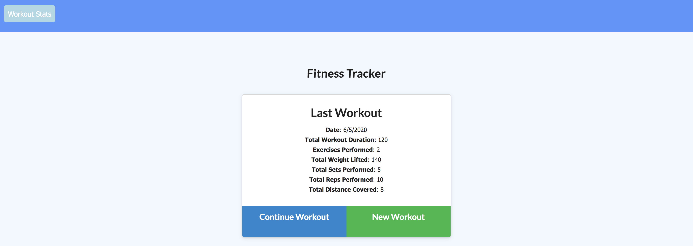

# Workout Tracker
     

---

## Description:
This is an application that allows user to create new a new workout plan for each day, add various exercises to that day's workout, track their daily stats, and work towards their fitness goals! This application uses a MongoDatabase to store a user's workout data, Express to handle routes, and is deployed on Heroku.

---

## Table of Contents:
* [Installation](#installation)
* [Usage](#usage)
* [Demonstration](#demonstration)
* [License](#license)
* [Contributing](#contributing)
* [Resources](#resources)
* [Bug Fixes](#bug-fixes)
* [Future Development](#future-development)
* [Questions](#questions)

---

## Installation:
No installation is required.

---

## Usage:
To use the application, to [this link](https://whispering-tundra-66062.herokuapp.com/).

How to use this application (if you are using it for the first time):
* __step 1:__ On the Home Page, click the green "New Workout" button.

* __step 2:__ You will be taken to the Exercise Page, where you will first need to select what type of exercise to add to today's workout (options are "resistance" or "cardio").

* __step 3:__ Fill in additional exercise information. If you choose to do a "cardio" exercise, you will need to fill in the name, distance, and duration of the exercise. If you choose "resistance", you will be asked to enter the exercise's name, weight, sets, reps, and duration. 

* __step 4:__ Once all information for a particular exercise has been filled in, you can do one two things:
  * 1) If this is the only/last exercise you wish to add to today's workout, click the blue "Complete" button. This will take you back to the Home Page, where you will see your stats.
  * 2) If you wish to add more exercises to the workout plan, click the green "Add Exercise" button, which will add the exercise you previously input and then allow you to add another type of exercise.

* __step 5:__ Once you are done adding exercises to a workout plan, you will see all of your accumulated stats on the Home Page. If you wish to add more exercises to that day's workout, on the Home Page click the blue "Continue Workout" button and follow steps 3 and 4 above. If you wish to see the stats in a more visual way, you can click the "Workout Stats" button in the upper-left corner of the browser.

* __step 6:__ In the Stats page, there are 4 graphs (please see [Future Development](#future-development) for information on existing problems with this page):
  * 1) (top-left) a line graph depicting the total duration of a workout (the sum of the time it took to finish each exercise in a workout) for each day
  * 2) (bottom-left) a pie graph depicting a breakdown of how long each exercise in a workout took to complete
  * 3) (top-right) a bar graph showing the total number of pounds lifted during a workout for each day
  * 4) (bottom-right) a pie graph showing a breakdown of the weight lifted during each exercise performed

---

## Demonstration:
To see how to use the application, go to [this link](https://drive.google.com/file/d/1KImmxNjz60sr8XBxToeeBLVfUZ8tJNPN/view).

---

## License:
[MIT License](https://opensource.org/licenses/MIT)

Copyright © 2020 Chyna Davis

Permission is hereby granted, free of charge, to any person obtaining a copy
of this software and associated documentation files (the "Software"), to deal
in the Software without restriction, including without limitation the rights
to use, copy, modify, merge, publish, distribute, sublicense, and/or sell
copies of the Software, and to permit persons to whom the Software is
furnished to do so, subject to the following conditions:

The above copyright notice and this permission notice shall be included in all
copies or substantial portions of the Software.

THE SOFTWARE IS PROVIDED "AS IS", WITHOUT WARRANTY OF ANY KIND, EXPRESS OR
IMPLIED, INCLUDING BUT NOT LIMITED TO THE WARRANTIES OF MERCHANTABILITY,
FITNESS FOR A PARTICULAR PURPOSE AND NONINFRINGEMENT. IN NO EVENT SHALL THE
AUTHORS OR COPYRIGHT HOLDERS BE LIABLE FOR ANY CLAIM, DAMAGES OR OTHER
LIABILITY, WHETHER IN AN ACTION OF CONTRACT, TORT OR OTHERWISE, ARISING FROM,
OUT OF OR IN CONNECTION WITH THE SOFTWARE OR THE USE OR OTHER DEALINGS IN THE
SOFTWARE.

---

## Contributing:
Contributor Covenant Code of Conduct
Our Pledge
We as members, contributors, and leaders pledge to make participation in our
community a harassment-free experience for everyone, regardless of age, body
size, visible or invisible disability, ethnicity, sex characteristics, gender
identity and expression, level of experience, education, socio-economic status,
nationality, personal appearance, race, religion, or sexual identity
and orientation.
We pledge to act and interact in ways that contribute to an open, welcoming,
diverse, inclusive, and healthy community.
Our Standards
Examples of behavior that contributes to a positive environment for our
community include:

* Demonstrating empathy and kindness toward other people
* Being respectful of differing opinions, viewpoints, and experiences
* Giving and gracefully accepting constructive feedback
* Accepting responsibility and apologizing to those affected by our mistakes,
and learning from the experience
* Focusing on what is best not just for us as individuals, but for the
overall community

Examples of unacceptable behavior include:

* The use of sexualized language or imagery, and sexual attention or
advances of any kind
* Trolling, insulting or derogatory comments, and personal or political attacks
* Public or private harassment
* Publishing others’ private information, such as a physical or email
address, without their explicit permission
* Other conduct which could reasonably be considered inappropriate in a
professional setting

Enforcement Responsibilities
Community leaders are responsible for clarifying and enforcing our standards of
acceptable behavior and will take appropriate and fair corrective action in
response to any behavior that they deem inappropriate, threatening, offensive,
or harmful.
Community leaders have the right and responsibility to remove, edit, or reject
comments, commits, code, wiki edits, issues, and other contributions that are
not aligned to this Code of Conduct, and will communicate reasons for moderation
decisions when appropriate.
Scope
This Code of Conduct applies within all community spaces, and also applies when
an individual is officially representing the community in public spaces.
Examples of representing our community include using an official e-mail address,
posting via an official social media account, or acting as an appointed
representative at an online or offline event.
Enforcement
Instances of abusive, harassing, or otherwise unacceptable behavior may be
reported to the community leaders responsible for enforcement at
[INSERT CONTACT METHOD].
All complaints will be reviewed and investigated promptly and fairly.
All community leaders are obligated to respect the privacy and security of the
reporter of any incident.
Enforcement Guidelines
Community leaders will follow these Community Impact Guidelines in determining
the consequences for any action they deem in violation of this Code of Conduct:
1. Correction
Community Impact: Use of inappropriate language or other behavior deemed
unprofessional or unwelcome in the community.
Consequence: A private, written warning from community leaders, providing
clarity around the nature of the violation and an explanation of why the
behavior was inappropriate. A public apology may be requested.
2. Warning
Community Impact: A violation through a single incident or series
of actions.
Consequence: A warning with consequences for continued behavior. No
interaction with the people involved, including unsolicited interaction with
those enforcing the Code of Conduct, for a specified period of time. This
includes avoiding interactions in community spaces as well as external channels
like social media. Violating these terms may lead to a temporary or
permanent ban.
3. Temporary Ban
Community Impact: A serious violation of community standards, including
sustained inappropriate behavior.
Consequence: A temporary ban from any sort of interaction or public
communication with the community for a specified period of time. No public or
private interaction with the people involved, including unsolicited interaction
with those enforcing the Code of Conduct, is allowed during this period.
Violating these terms may lead to a permanent ban.
4. Permanent Ban
Community Impact: Demonstrating a pattern of violation of community
standards, including sustained inappropriate behavior,  harassment of an
individual, or aggression toward or disparagement of classes of individuals.
Consequence: A permanent ban from any sort of public interaction within
the community.
Attribution
This Code of Conduct is adapted from the Contributor Covenant,
version 2.0, available at
https://www.contributor-covenant.org/version/2/0/code_of_conduct.html.
Community Impact Guidelines were inspired by Mozilla’s code of conduct
enforcement ladder.
For answers to common questions about this code of conduct, see the FAQ at
https://www.contributor-covenant.org/faq. Translations are available at
https://www.contributor-covenant.org/translations.

---

## Resources:
* __npm packages:__
  * [express](https://www.npmjs.com/package/express)
  * [mongoose](https://www.npmjs.com/package/mongoose)
  * [morgan](https://www.npmjs.com/package/morgan)
* __deployment:__
  * [Heroku](https://www.heroku.com/home)
  * [MongoDB](https://mongoosejs.com/docs/guide.html)

---

## Bug Fixes:
The starter code for this assignment came with some issues, particularly in the _public/stats.js_ file. The issues and their solutions are as follows:
* __Problem 1:__
  * __issue:__ Although a __Workout__ can have multiple __Exercises__ in it, the _stats_ page will separate the duration of each __Exercise__ into separate days instead of adding up all the time accrued for all exercises in one workout.
  * __solution:__ Fix the code so that the number of hours exercised in a day is found by using the "totalDuration" field is used instead of individual durations.
* __Problem 2:__
  * __issue:__ For any __Exercises__ categorized as "resistance", the stats page will separate their weights into different dates, even if they are in the same __Workout__.
  * __solution:__ Get the individual weights lifted for each __Exercise__ in a __Workout__ and total them up. Thus, the _stats_ page now shows each __Workout's__ total weight lifted in one bar-graph column.

## Future Development:
There are some issues with the front-end code (came pre-developed and _not_ written by me) that need to be fixed. They are as follows:
* On the main page, add a link to go to the _stats_ page (so that the user does not have to type in the _/stats_ route in the URL bar).
* Fix the code for the _stats_ page for the following:
  * Fix the way the _stats_ page messes up the entries for the days of the week (for example, Day-1 of a user's workout routine will always be input as "Sunday" according to the _stats_ page, regardless of which day of the week they actually started).
  * Fix the 2 pie graphs so that exercises that are "completed" are not crossed-out in the legend and omitted from the chart.
  * Fix the bottom-right pie graph so that it also omits "cardio"-type exercises from the chart
* Make it so that a user can only start a new workout once a day, so as to facilitate functionality of the _stats_ page.

---

## Questions: 
for any questions, please contact:

 

__[CrainDavis](https://github.com/CrainDavis)__ at chyna.davis11@gmail.com